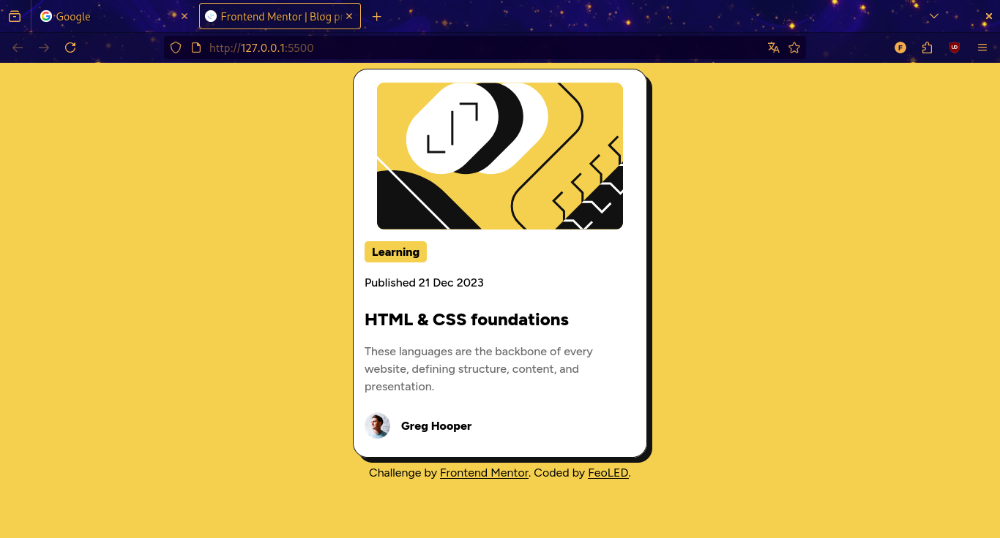
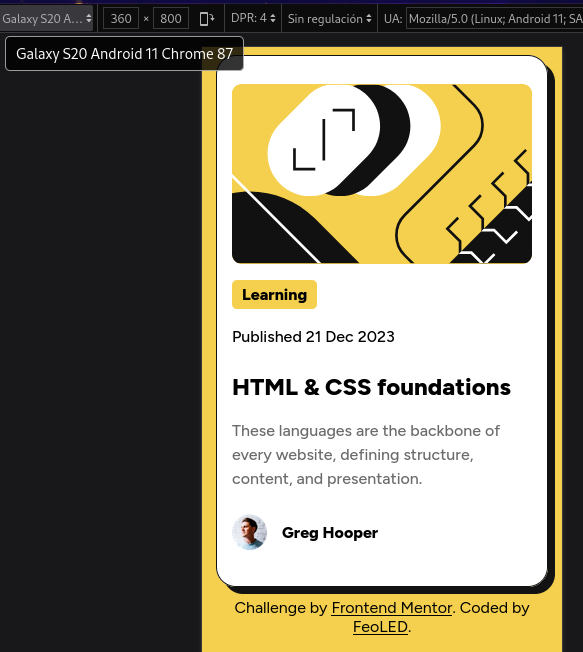

# Frontend Mentor - Blog preview card solution

This is a solution to the [Blog preview card challenge on Frontend Mentor](https://www.frontendmentor.io/challenges/blog-preview-card-ckPaj01IcS). Frontend Mentor challenges help you improve your coding skills by building realistic projects. 

## Table of contents

- [Overview](#overview)
  - [The challenge](#the-challenge)
  - [Screenshots](#screenshot)
  - [Links](#links)
- [My process](#my-process)
  - [Built with](#built-with)
  - [What I learned](#what-i-learned)
  - [Continued development](#continued-development)
- [Author](#author)


## Overview

### The challenge

Users should be able to:

- See hover and focus states for all interactive elements on the page

### Screenshots

Laptop browser preview:



Phone preview: 



### Links

- Solution URL: 

- Live Site URL: 


## My process

### Built with

- Semantic HTML5 markup
- CSS custom properties
- Flexbox

### What I learned

I wouldn't say that I learned a lot doing this. Most of the process was just figuring out how to proceed and bumping into problems related with CSS (and the pain of solving them).

For starters, a thing I like to do when I have to build the presentation is adding a border to the main container (and if there's no container, proceed to add it, and then putting the border).

At the very beginning, I focused on the more "outsider" things, like the meta tags, removing the style tag to add a proper link connecting with the newly created stylesheet.

As I was adding colors, at first I had to juggle with flexbox because when I applied it to one element, it affected the distribution of the child elements. So what I did? More divs.

Okay there was this design problem where I didn't know how to align the text elements and the author section to the left. I tried with "display:flex" followed by "justify-items: left"...it didn't work. But then I got inspired by my past experience with "margin-top: auto" (this one to keep the footer at the bottom of the page) and assigned to the desired elements "margin-right: auto"...all to the left. 

There is a particularly nasty problem I have near the end with the elements inside the card. When I reduced the browser's height (a foolish thing to focus on but I was paranoid) the elements near the bottom of the card broke free from the container!

As i scrolled down, the text and the author box slid down, "floating" out of the card...

I looked on Google, and it was an overflow problem...among the solutions there was the "overflow" property. I started to play with the different values and chose "scroll"

```
.card{
  overflow:scroll;
}
```
That meant that when the viewport's height changed, the card will generate a scrollbar, allowing to read the elements. I wasn't happy with this but it was the least ugly solution at the time.


### Continued development

I'm not quite familiar yet with the differents ways one can handle overflow and related techniques. 
Knowing that there'll be more complex project, I want to keep developing these methods.


## Author

- Website - 
- Frontend Mentor - 
